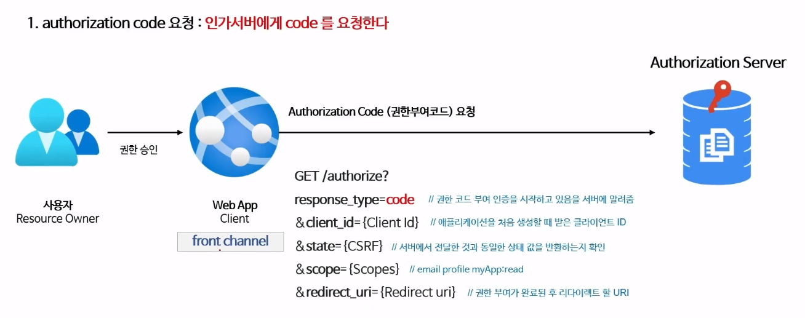
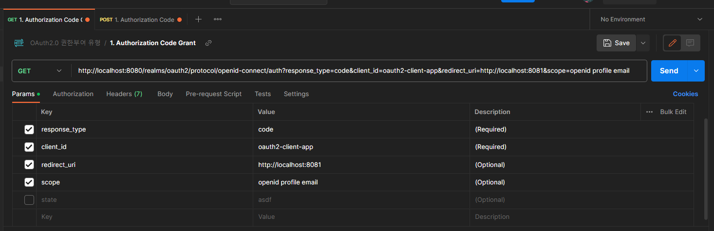
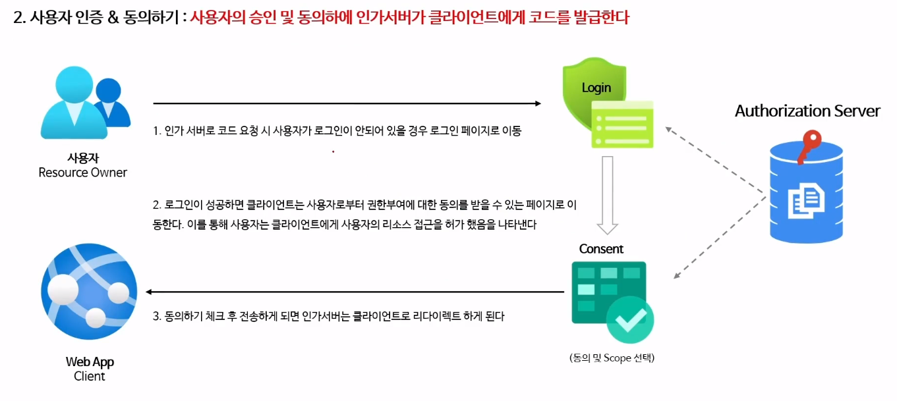
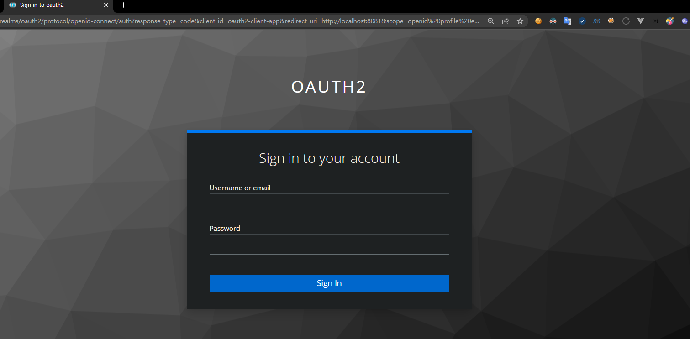
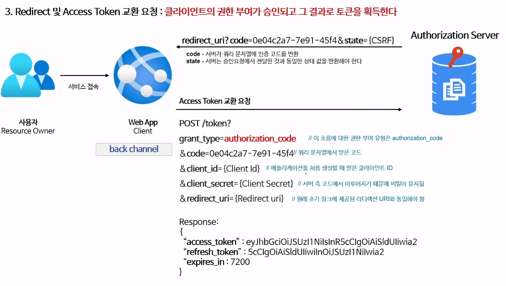

### Authorization Code Grant Type

#### 흐름 및 특징

1. 사용자가 애플리케이션을 승인하면 인가서버는 `redirect_uri` 로 임시 코드를 담아서 애플리케이션으로 다시 리다이렉션한다.

2. 애플리케이션은 해당 `code` 를 인가서버로 전달하고 `access_token` 으로 교환한다.
이떄, 애플리케이션이 인가서버에 `access_token` 을 요청할 때 `client-id` 와 `client-secret` 도 같이 보냄. 
요청을 받은 인가서버는 `client-id` 와 `client-secret` 를 검사하여 `code` 가 인터셉트 당해도 `code` 를 스스로 사용할 위헙이 줄어들게 한다.

> 따라서 access_token 이 사용자 또는 브라우저에 표시되지 않고 애플리케이션 전달하는 가장 안전한 방법이므로 토큰이 다른 사람에게 누출될 위험이 줄어든다.

#### 흐름

##### 1. Authorization Code 요청 : Client 가 Authorize Server 에게 Authorization Code (권한 부여 코드) 요청
 

response_type=code         // 권한 코드 부여 인증을 시작하고 있음을 서버에 알주는 역할. (Required)   
client_id=clientId         // 애플리케이션을 처음 생성할때 받은 Client-id 명시 (Required)
state={CSRF}               // 서버에서 전달한 것과 동일한 상태 값을 반환하는지 확인. (Optional)  
scope={Scopes}             // Resource Owner 자원에서 어떤 부분을 사용할지 명시 (Optional)  
redirect_uri={Redirect uri}// 권한 부여가 완료된 후 리다이렉트 할 URI 명시 (Optional 이는 Authorize Server 마다 다르다)

##### 2. 사용자 인증 & 동의하기 : 사용자의 승인 및 동의하에 인가서버가 클라이언트에게 코드를 발급한다.

   1. Client 가 보낸 권한부여요청을 받은 Authorization Server 는 해당 요청을 검사하고 (쿼리스트링으로 넘어온 변수들 Scope 등등)
      사용자로부터 권한부여에 대한 동의를 받을 수 있는 페이지로 이동한다. 하지만 사용자가 Authorization Server 에 로그인이 되어있지 않으면, 로그인 페이지로 이동하게 된다.

   2. 로그인이 성공적으로 이루어지면, Client 는 정상적으로 사용자로부터 권한 부여에 대한 동의를 받을 수 있는 페이지로 이동한다.
      이 과정을 통해 사용자는 클라이언트에게 사용자의 리소스 접근을 허가했음을 나타낸다.
      
   3. 이어서 동의하기를 체크 후 전송하게 되면, Authorization Server 는 Client 의 redirect_uri 로 리다이렉트시키게되는데, 권한부여코드를 쿼리스트링으로 넘기게된다. 

##### 3. Redirect 및 AccessToken 교환 요청 : Client 의 권한 부여가 승인되고 그 결과로 토큰(AccessToken)을 획득한다.

   1. Authorize Server 에서 리다이렉션 시킨 redirect_uri 경로에서 권한부여코드인 code 파라미터값을 확인한다. 

   2. 이제 권한부여코드인 code 와 AccessToken 을 교환하면 된다.

   3. 이떄 code 와 AccessToken 을 교환하는 요청은 POST 로 이루어진다.

>  code 와 AccessToken 을 교환하는 요청은 grant_type, code, client_id, client_secret 모두 필수이다.
여기서 redirect_uri 는 권한부여코드를 요청할떄 명시해주었다면 필수값이 된다.

사실 이전단계들은 모두 이 AccessToken 을 받기위한 과정이다.

AccessToken 을 받았다는 의미는 Client 가 사용자인 ResourceOwner 를 대신해서 자원을 ResourceServer 에서 갖고올 수 있는 권한을 부여받았다는 의미이다.

따라서 발급받은 AccessToken 으로 ResourceServer 에서 접근해 ResourceOwner 의 자원에 접근할 수 있다.

