### OAuth2.0 Roles 이해

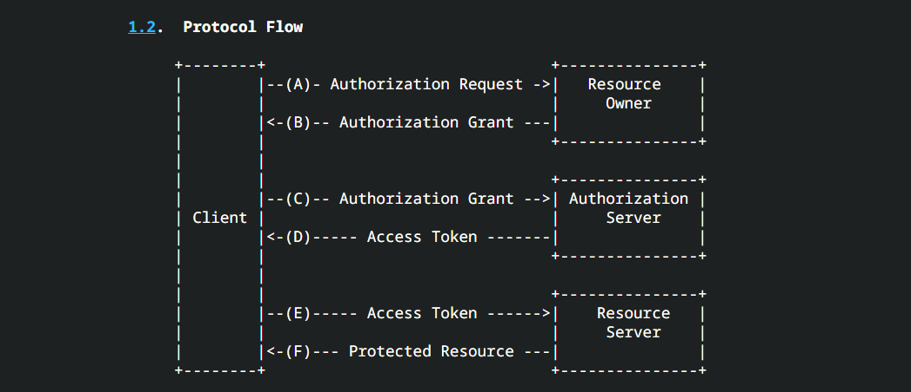

1. Resource Owner (자원 소유자)

* 보호된 자원에 대한 접근 권한을 부여할 수 있는 주체, 사용자로서 계정의 일부에 대한 접근 권한을 부여하는 사람.
  
* 사용자를 대신하여 작동하려는 모든 클라이언트는 먼저 사용자의 허가를 받아야 한다.

2. Resource Server (보호 자원 서버)

* 타사 어플리케이션에서 접근하는 사용자의 자원이 포함된 서버를 의미한다.

* `AccessToken` 을 수락 및 검증할 수 있어야 하며 권한 체계에 따라 요청을 승인할 수 있어야 한다.

3. Authorization Server (인가 서버)

* 클라이언트가 사용자 계정에 대한 동의 및 접근을 요청할 때 상호 작용하는 서버로서 클라이언트의 권한 부여 요청을 승인하거나 거부하는 서버 

* 사용자가 클라이언트에게 권한 부여 요청을 승인한 후 `AccessToken` 을 클라이언트에게 부여하는 역할

4. Client (클라이언트)

* 사용자를 대신하여 권한을 부여받아 사용자의 리소스에 접근하려는 어플리케이션

* 사용자를 권한 부여 서버로 안내하거나 사용자의 상호 작용 없이 권한 부여 서버로부터 직접 권한을 얻을 수 있다.

> 사용자의 데이터를 갖고올수 있는 권한을 획득하여 사용자를 대신해서 데이터를 갖고와 서비스에 이용하고자하는 것이 Client 의 목적.

> 따라서 사용자를 권한부여 서버로 안내한다. --> 
> 왜? 자기가 권한 부여서버에서 권한을 획득해야되는데, 권한서버는 사용자의 승인이 필요함. 따라서 클라이언트가 사용자로 하여금 인가서버에 승인할수있는 곳으로 안내하는 것임.

### OAuth2.0 Roles

Client 가 요청을했지만, 로그인해야한다는 html 코드가 온다. --> 이는 사용자의 승인이 필요하다는 의미이다. 
인가서버가 Client 에게 Code 를 발급하든, AccessToken 을 발급하든 권한을 부여하기위해서는 실제 사용자의 데이터를 가져오는것이 목적이고 사용자의 승인을 필요로 함.--> 따라서 로그인창이 나오는 것이다.

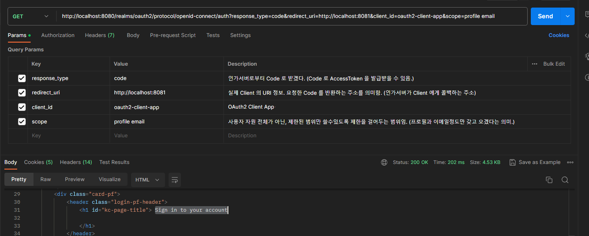

이제 PostMan 에서의 보낸 동일한 요청을 브라우저에서 인가서버에게 보내게 되면, 인가서버는 Client 에게 사용자로하여금 승인을 받게하기위해 로그인창으로 안내하게됨. 
--> 이로그인은 `사용자 (Resoucre Owner)` 의 역할이 됨.  
또한, Client 가 인가서버에게 1차적으로 임시Code 를 발급받는 단계임.

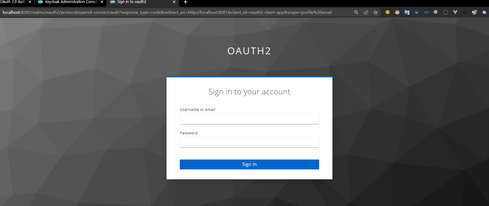

이제 로그인하게 되면 동의화면이 나오게되는데 Client 가 인가서버에게 권한을 받되, 제한된 범위 (Scope) 안에서 권한을 부여하겠다는 의미임.

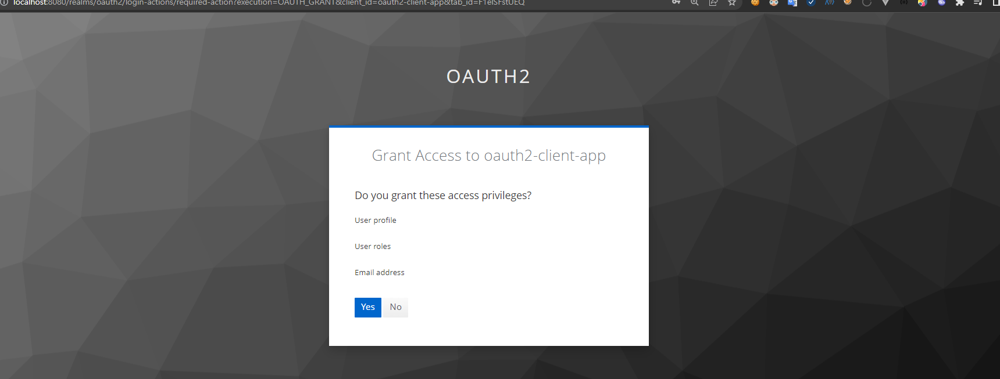

이제 상단의 code 쿼리파람의 값이 임시코드이며, 이 Code 를 통해 AccessToken 을 발급받기위해 다시 인가서버에 요청해야한다.

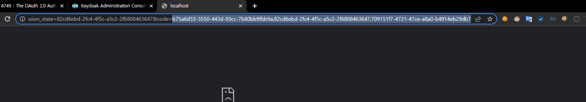

KeyClock 의 Realm settings 의 OpenID Endpoint Configuration 에 들어가서 인가서버의 token_endpoint 를 확인후, 해당 경로에 AccessToken 발급 요청을 보내면 된다.

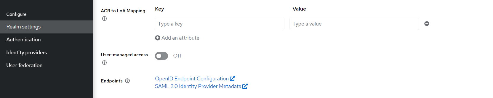
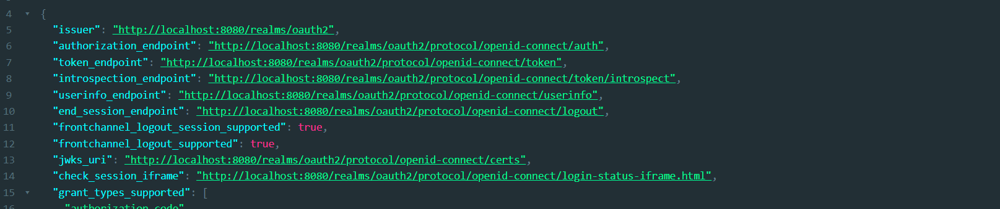

요청을 보내면, 인가서버인 KeyClock 에서 AccessToken 을 내려준것을확인 가능하다.

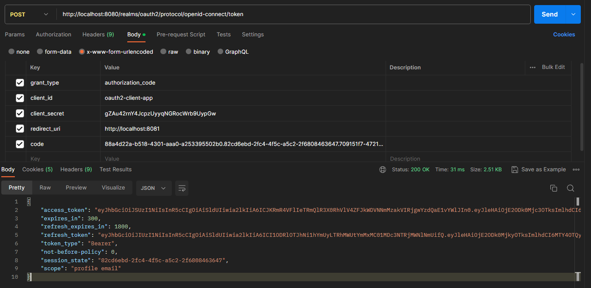

이제 받은 AccessToken 을 userinfo endpoint 경로에 요청을 보내주면 Scope 에 지정한 정보들을 얻을 수 있다.

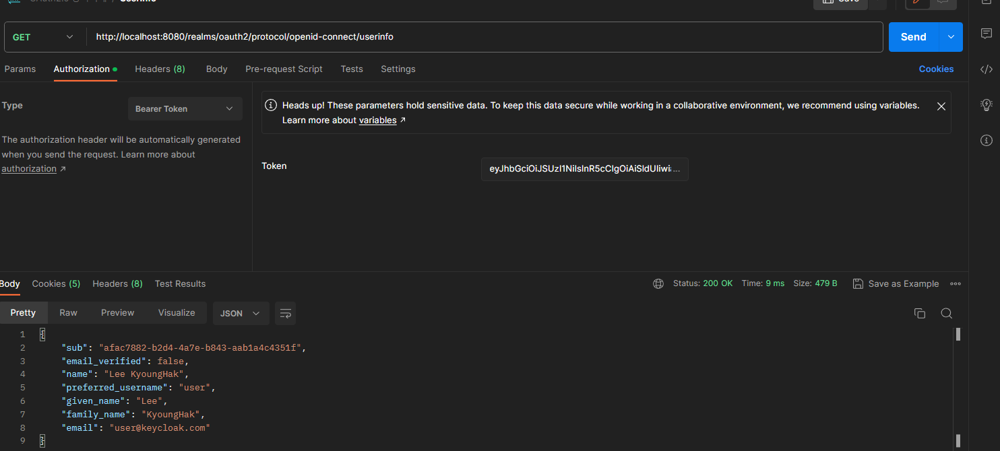

### OAuth2.0 Client Types 이해

### OAuth2.0 Token Types 이해

OAuth 2.0 토큰타입에는 4 가지가 있음.

#### 1. AccessToken 

* 클라이언트에서 사용자의 `보호된 리소스에 접근하기 위해 사용하는 일종의 자격 증명` 으로서 역할을 하며 리소스소유자(Resource Owner)가 클라이언트에게 부여한 권한

* 일반적으로 JWT(JSON Web Token) 형식을 취하지만 사양에 따라 그럴 필요는 없다.

* 토큰에는 해당 액세스 기간, 범위 및 서버에 필요한 기타 정보가 있다.

* 타입에는 식별자 타입(Identifier Type) 과 자체 포함타입(Self-Contained Type) 이 있다.

##### 식별자 타입(Identifier Type)

* `Authorization Server` 는 DB 에 토큰의 내용을 저장하고 이 토큰에 대한 고유 식별자(난수값 혹은 무의미한 값)만 `Client`에 다시 발행하는 방식이다.

* 클라이언트가 발급받은 토큰을 가지고 `Resource Server` 에 자원을 요청하게 되면, `Resource Server` 는 `Authorization Server` 에 토큰을 전달해서 유효한지 확인해야한다.

* 이는 즉. `Client` 가 `Resource Server` 에 자원을 요청할때마다, 토큰을 받은 `Resource Server` 는 토큰의 유효성을 검사하기 위해 인가서버에 대한 커넥션을 얻고 매번 DB 를 조회해야하기떄문에, 비용이 크게 증가한다는 단점이 있다.    

##### 자체 포함타입(Self-Contained Type)

* `JWT`(JSON Web Token) 형식으로 발급되며 `Claim` 및 `Expire` 가 있는 보호된 데이터 구조이다. (사용자의 데이터, Scope 등 유의미한 값을 `Claim` 정보로 넣을 수 있음.)
  
* `Resource Server` 는 검증키 등의 핵심 자료에 대해 알기만 하면 발급자인 `Authorization Server`와 통신할 필요 없이 자체 포함된 토큰의 유효성을 검사할 수 있다.

* 특정한 암호화 알고리즘에 의해 `Private Key`  로 `Sign` 되고 `Public Key` 로 검증할 수 있으며 만료될때까지 유효하다.

* 따라서 이 `Token` 이 위변조되지않았다는 `Verify` 만 제대로 해주면 `인증된 사용자로 판단`하여 `Token` 에 저장하였던 `Claim(기타정보)` 를 추출해서 활용할 수 있다. 

#### 2. RefreshToken

* 액세스 토큰이 만료된 후 새 액세스 토큰을 얻기 위해 클라이언트 응용 프로그램에서 사용하는 자격 증명

* 액세스 토큰이 만료되는 경우 클라이언트는 권한 부여 서버로 인증하고 Refresh Token 을 전달한다.

* 인증 서버는 Refresh Token 의 유효성을 검사하고 새 액세스 토큰을 발급한다.

* Refresh Token 은 액세스 토큰과 달리 권한 서버 토큰 엔드포인트에만 보내지고 리소스 서버에는 보내지 않는다.

#### 3. OpenID Connect 챕터에서 학습함

나중에 작성.

#### 4. Authorization Code

* `권한 부여 코드 흐름(Authroization Code Grant Flow) 에서 사용`되며 이 코드는 `클라이언트가 액세스 토큰과 교환활 임시코드` 이다.
  
* PostMan 에서 `response_type = code` 가 `Authorization Code` 를 가지고오겠다는 의미이다.

*  `Authorization Code` 는 `redirect_uri` 에 명시한 경로로 `Redirection` 하며 `Authorization Code` 룰 파라미터로 전달해준다.

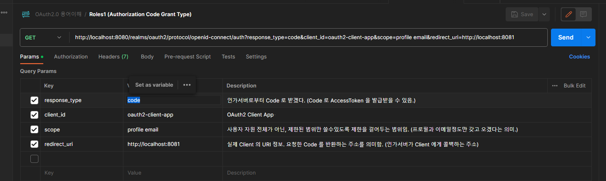

* 이렇게 받은 `Authorization Code` 는 `Authorization Server` 에 전달되어 `AccessToken` 을 받아오는 역할을 한다.

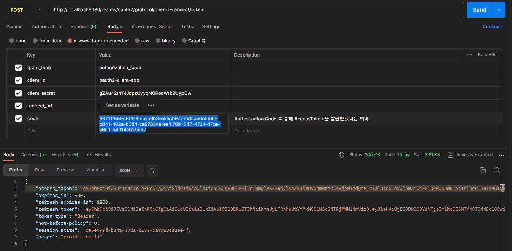

* `Authorization Code` 와 `AccessToken` 를 교환하고나면 `Authorization Code` 는 폐기된다.

